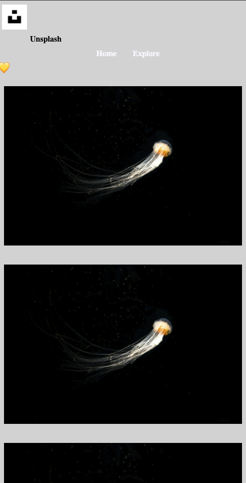
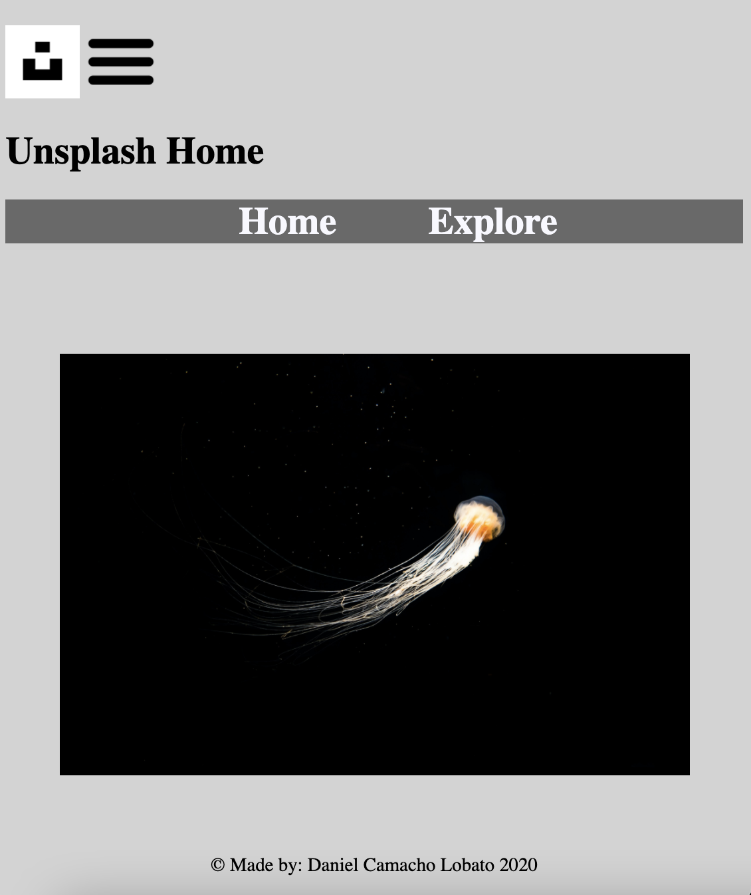

# Procesverslag
**Auteur:** - Daniel Camacho Lobato-

Markdown cheat cheet: [Hulp bij het schrijven van Markdown](https://github.com/adam-p/markdown-here/wiki/Markdown-Cheatsheet). Nb. de standaardstructuur en de spartaanse opmaak zijn helemaal prima. Het gaat om de inhoud van je procesverslag. Besteedt de tijd voor pracht en praal aan je website.

## Bronnenlijst
1. -bron 1-
2. -bron 2-
3. -...-

## Eindgesprek (week 7/8)

-dit ging goed & dit was lastig-

**Screenshot(s):**

-screenshot(s) van je eindresultaat-

## Voortgang 3 (week 6)

-same as voortgang 1-

## Voortgang 2 (week 5)
### Stand van zaken
-dit ging goed & dit was lastig-
De eerste opdrachten zijn wel redelijk te doen, opdracht 2&3 zijn nog echt te moeilijk om te maken.
**Screenshot(s):**
Ik heb alleen een hartje toegevoegd, alleen dit werkte niet.

### Agenda voor meeting
-samen met je groepje opstellen-
Luca: De zoekbalk is nog lastig, en luca wilt zich meer in flexbox verdiepen.
Jenny: Hamburgermenu werk niet goed, de position werkt niet nog optimaal.
Daniel: Hulp met hamburgermenu of nav, zodat dit goed staat, het gele hartje lukte bij mij niet.

### Verslag van meeting
na de meeting invullen........

## Voortgang 1 (week 3)
### Stand van zaken
-dit ging goed & dit was lastig-
De afbeelding en nav, lukten wel alleen zijn nog niet helemaal af. Het positioneren vond ik lastig en de hamburgermenu moet ik nog helemaal uitwerken.

**Screenshot(s):**

-screenshot(s) van hoe ver je bent met korte uitleg-

Dit is de eerste versie van de homepage, je kan al naar de volgende pagina klikken maar hier staat nog niks op.

### Agenda voor meeting
-samen met je groepje opstellen-
Luca: /
Jenny: - Hoe moet je een slider maken?/ Hoe moet ik de blauwe lijnen die je tussendoor ziet? / Position werkt nog niet, wat doe ik fout?/
Iconen in nav -> hoe moet ik deze vormgeven en laten werken?
Daniel: - Hoe maak je een slider met meerdere afbeelding / Hoe krijg ik mn hamburgermenu op de juiste plaats / zoekbalk lukte niet

### Verslag van meeting
FED-voortgang 26 september 2020
De slider voor mijn website is een optie, het hoeft niet!
Je kan dit doen dmv items en li, etc....

Aangezien ik niet een CSS master ben, keep it simple :)
Als er vragen zijn over bepaalde onderwerpen waar ik moeite mee heb, vraag de studentassistentes via Teams!!!
Mijn uiteindelijke website van Unsplash hoeft niet super uitgebreid te zijn. 2 pagina + een responsive design.

## Breakdownschets (week 1)

-uitwerken voor de 1e werkgroep - eind van de eerste week-
Homepage:

Explorepage:

## Intake (week 1)
-uitwerken voor de kick-off werkgroep - begin van de eerste week-

**Je startniveau:** -blauw-

**Je focus:** - responsive-

**Je opdracht:** -https://unsplash.com/-

**Screenshot(s) van de eerste pagina (small screen):**

**Screenshot(s) van de tweede pagina (small screen):**

